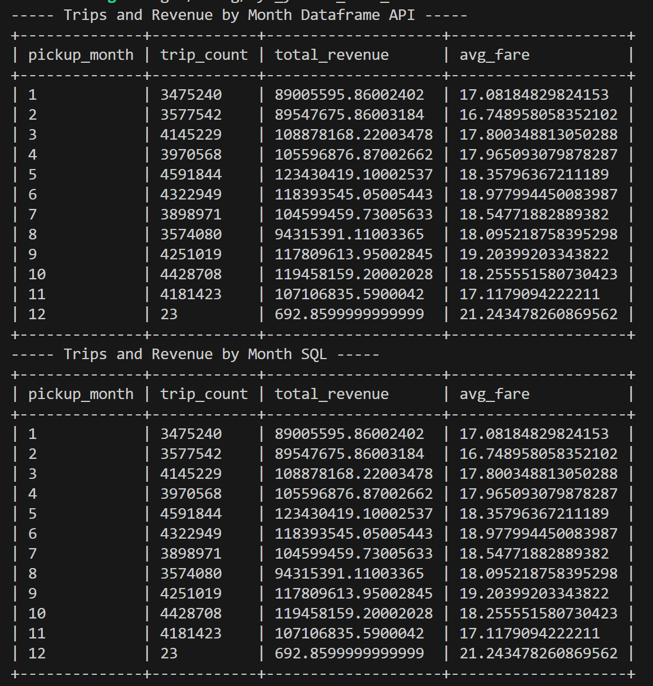
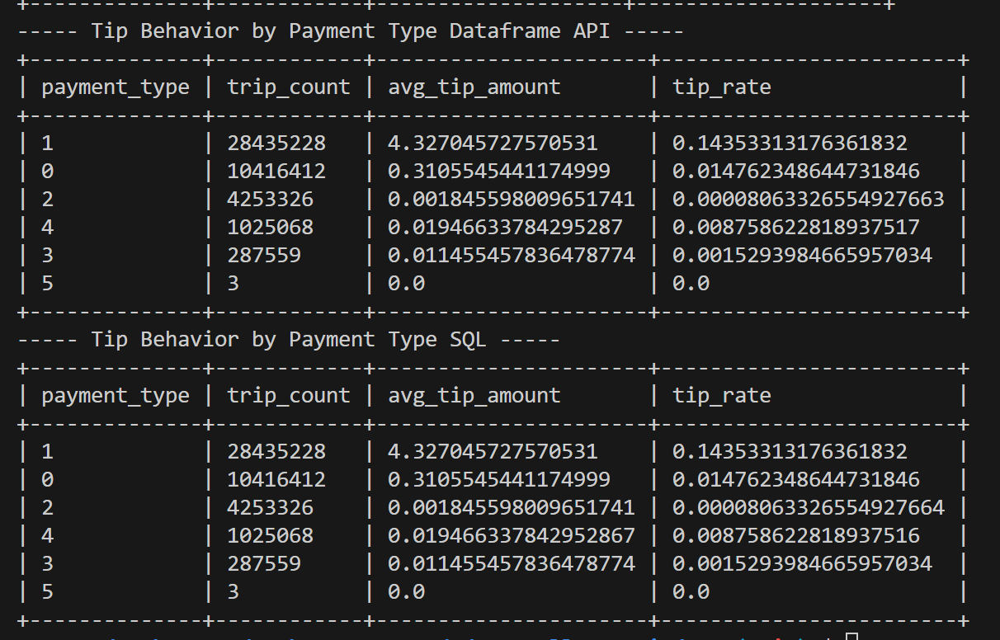

#NYC_YELLOW_TAXI_DATA

### What this project does
* Aggregates data of NYC Yellow Taxi Data
* Processes the rows using Rust and Dataframe API and SQL

### Dataset Source Link
https://www.nyc.gov/site/tlc/about/tlc-trip-record-data.page

### How to download data
1. Visit the NYC tlc website
2. Download the parquet files for the desired month and year
3. Place them in a folder called 'parquet_files/' in the root of the project.

### How to run the project
cargo run

### What first aggregation does
* Aggregates the Trips and Revenue by Month, sorted in ascending order by month

### What the second aggregation does
* Aggregates the Tip behavior by payment type, sorted from highest to lowest trip count

